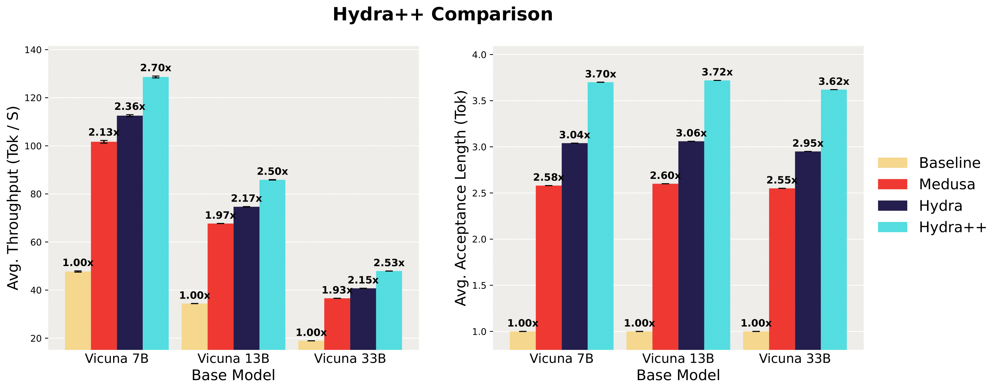

<p align="center">
  
</p>

<h1 align="center">
  Hydra: Sequentially Dependent Draft Heads for Medusa Decoding
</h1>


<p align="center">
| <a href="https://arxiv.org/abs/2402.05109"><b>Paper</b></a> |
</p>

---
## Introduction

Hydra is a speculative decoding framework that leverages tree-based decoding and draft head-based draft models as proposed in [Medusa](https://www.together.ai/blog/medusa).
We make a simple change to the structure of the draft heads and condition each draft head on the candidate continuation so far such the draft heads are sequentially dependent.
This along with some training objective and other head architecture changes leads to Hydra decoding improving throughput by up to 1.3x compared to Medusa decoding.
For more details see our [paper](https://arxiv.org/abs/2402.05109).

Our codebase is forked from the [Medusa codebase](https://github.com/FasterDecoding/Medusa). If you find this work interesting you should check out their method!

<div align="center">
  <picture>
  
  </picture>
  <br>
  <div align="center" width="80%">
  <em>Baseline, Medusa, and Hydra decoding on Vicuna-7b with a sample prompt. Note that the video is sped up by a factor of 4x for brevity.</em>
  </div>
  <br>
</div>
<!---
<div align="center">
  <picture>
   
  </picture>
  <br>
  <div align="center" width="80%">
  <em>Medusa-1 on Vicuna-7b.</em>
  </div>
  <br>
</div>
-->

Medusa introduces multiple lightweight draft heads on top of the frozen base LLM, which are used to predict multiple tokens ahead. This method reduces the size of speculative draft models, can utilize the high-quality representations of the base model, and is a simpler speculative framework. However, standard draft heads are only a function of the base LLM's hidden states from previously verified tokens, making them unaware of earlier tokens in the current candidate continuation.

Hydra improves upon Medusa by leveraging sequentially dependent draft heads that are aware of earlier tokens in the candidate continuation. This simple design change significantly improves the prediction quality of the heads, thus improving the overall decoding efficiency. We study these Hydra heads and alternate draft head architectures over a range of Vicuna models in the batch size 1 regime, achieving 2.5-2.7x improvements in throughput over baseline and 1.3x improvement in throughput over Medusa.

<div align="center">
  <picture>
  
  </picture>
  <br>
  <div align="left" width="80%">
  <em> A comparison of throughput and average acceptance length between standard decoding, Medusa decoding, baseline Hydra decoding, and Hydra++ (the most optimized Hydra recipe). </em>
  </div>
  <br>
</div>

## News

2024/02: Paper has been released here on [arXiv](https://arxiv.org/abs/2402.05109)!

## Todo

- [ ] Batch size > 1 inference
- [ ] Walk through guides for how Hydra decoding works

## Table of Contents
- [Introduction](#introduction)
- [News](#news)
- [Todo](#todo)
- [Table of Contents](#table-of-contents)
- [Setup](#setup)
- [Model Weights](#model-weights)
- [Inference](#inference)
- [Training](#training)
  - [Dataset](#dataset)
  - [Training Script](#training-script)
  - [HF Integration](#hf-integration)
- [Evaluation](#evaluation)
- [Citation](#citation)
- [Important Files](#important-files)
- [Acknowledgements](#acknowledgements)

## Setup
```bash
git clone https://github.com/zankner/Hydra
cd Hydra
pip install -e .
```

## Model Weights

| Base Model   | Hugging Face Repo                                                     |
| ----------  | --------------------------------------------------------------------- |
| Vicuna-7B   | [ankner/hydra-vicuna-7b-v1.3](https://huggingface.co/ankner/hydra-vicuna-7b-v1.3)   |
| Vicuna-13B  |  [ankner/hydra-vicuna-13b-v1.3](https://huggingface.co/ankner/hydra-vicuna-13b-v1.3) |
| Vicuna-33B  |  [ankner/hydra-vicuna-33b-v1.3](https://huggingface.co/ankner/hydra-vicuna-33b-v1.3) |

## Inference

The current inference script for Hydra supports inference at a batch size of 1, and we provide a demo CLI. We plan to support batched inference in the future.

The current cli command for running inference is

```bash
python -m hydra.inference.cli --model [HuggingFace repo / path of Hydra model]
```

Note that this script assumes the presence of one GPU, so you may have to set the ```CUDA_VISIBLE_DEVICES``` environment variable. 

## Training

First, install the training version of the repo.
```bash
pip install -e ".[train]"
```

### Dataset
Install `git-lfs` first:
```bash
apt-get install git-lfs
git lfs install
```

Then, install the ShareGPT dataset:
```bash
git clone https://huggingface.co/datasets/Aeala/ShareGPT_Vicuna_unfiltered
```

Finally, create a train test split:
```bash
python hydra/data/partition_train_test.py
```

### Training Script
The code below will train a Hydra model. Specifically, it trains a Hydra++ head from Vicuna 7B base model.
```bash
torchrun --nproc_per_node=8 hydra/train/train.py --model_name_or_path lmsys/vicuna-7b-v1.3 \
    --data_path data/sharegpt/raw/ \
    --bf16 True \
    --output_dir ckpts \
    --num_train_epochs 10 \
    --global_batch_size 32 \
    --per_device_train_batch_size 4 \
    --per_device_eval_batch_size 4 \
    --gradient_accumulation_steps 1 \
    --dataloader_num_workers 8 \
    --evaluation_strategy "steps" \
    --eval_steps 0.1 \
    --save_strategy "no" \
    --learning_rate 5e-4 \
    --weight_decay 0.0 \
    --warmup_steps 100 \
    --lr_scheduler_type "cosine" \
    --final_lr_multiplier 0.33 \
    --logging_steps 1 \
    --tf32 True \
    --model_max_length 2048 \
    --lazy_preprocess True \
    --hydra_num_heads 4 \
    --hydra_num_layers 4 \
    --hydra_head_arch prefix-mlp \
    --grounded_heads true \
    --hidden_state_offset 0 \
    --lm_loss_weight 0.0 \
    --teacher_loss_weight 1.0 \
    --dropout_rate 0.2 \
    --weight_decay 0.1
```

To change the number of GPUs on the node, change ```--nproc_per_node```.

Note that this script only trains the Hydra draft heads, and leaves the base LLM frozen.

### HF Integration

To push to HF, run:

```bash
python -m hydra.hf_utils --folder [model folder] --repo [repo name]
```

## Evaluation

For evaluation results, please see the ```llm_judge/``` folder.

## Citation
If you found our work useful please consider citing it:
```bibtex
@misc{ankner2024hydra,
      title={Hydra: Sequentially-Dependent Draft Heads for Medusa Decoding}, 
      author={Zachary Ankner and Rishab Parthasarathy and Aniruddha Nrusimha and Christopher Rinard and Jonathan Ragan-Kelley and William Brandon},
      year={2024},
      eprint={2402.05109},
      archivePrefix={arXiv},
      primaryClass={cs.LG}
}
```

If you cite our work, please also consider citing the original Medusa decoding work upon which this work is based,

```bibtex
@article{cai2024medusa,
  title   = {Medusa: Simple LLM Inference Acceleration Framework with Multiple Decoding Heads},
  author  = {Tianle Cai and Yuhong Li and Zhengyang Geng and Hongwu Peng and Jason D. Lee and Deming Chen and Tri Dao},
  year    = {2024},
  journal = {arXiv preprint arXiv: 2401.10774}
}
```

## Important Files
```hydra/model/hydra_model.py``` contains the ```HydraModel``` class which wraps all the decoding heads in this repository. We also have a variety of different heads, such as basic MLP and Attention-prefixed MLP layers in the ```hydra/model/hydra_heads/``` folder.

## Acknowledgements
This project is heavily influenced by the work done by [Medusa](https://github.com/FasterDecoding/Medusa/), and we would like to thank them for open-sourcing their codebase, which we have built off of.

This project was also started as a class project for MIT's NLP class, and we would like to thank Profs. Jacob Andreas, Yoon Kim, and Chris Tanner for teaching that class, along with Marco Nocito and Dr. Michael Maune for valuable feedback.
